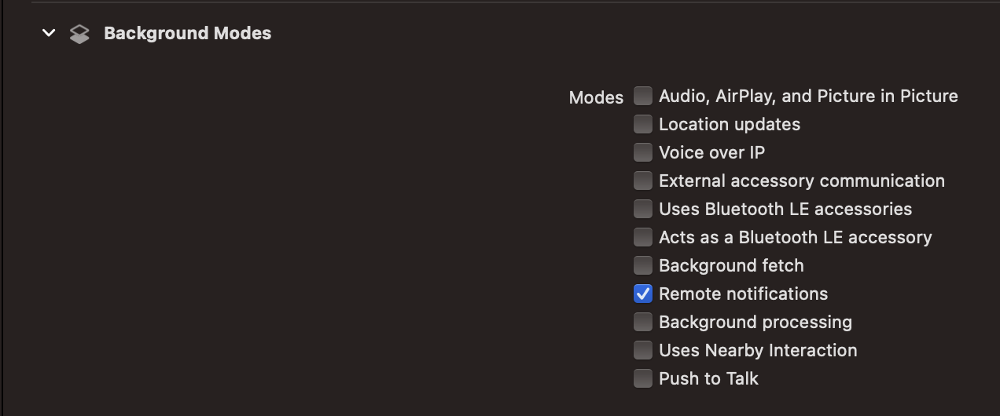
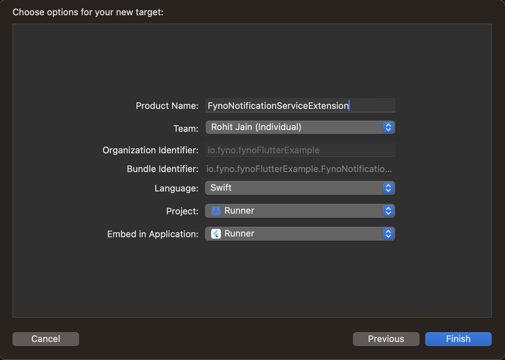
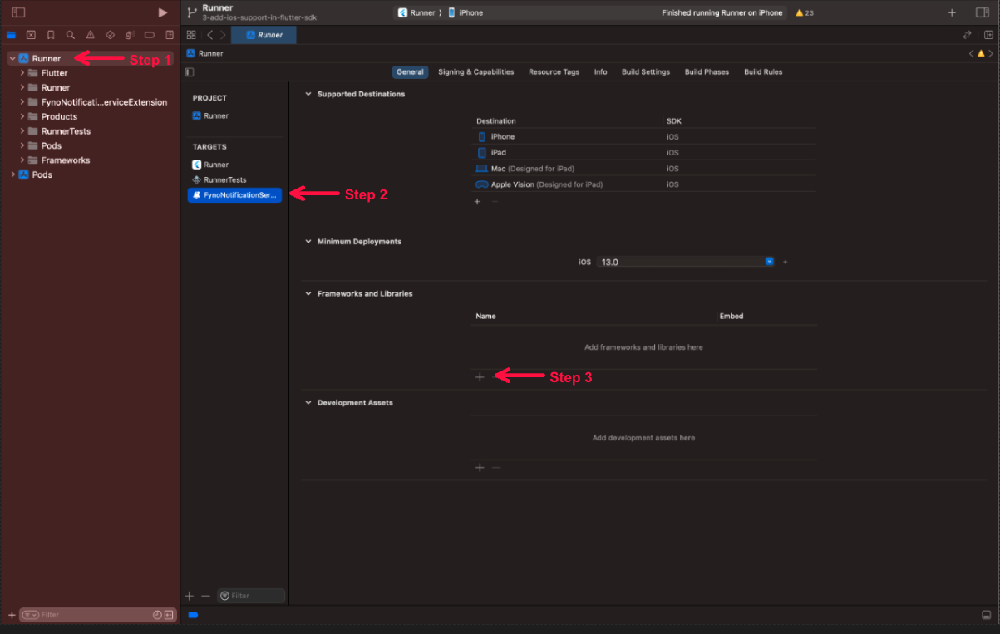
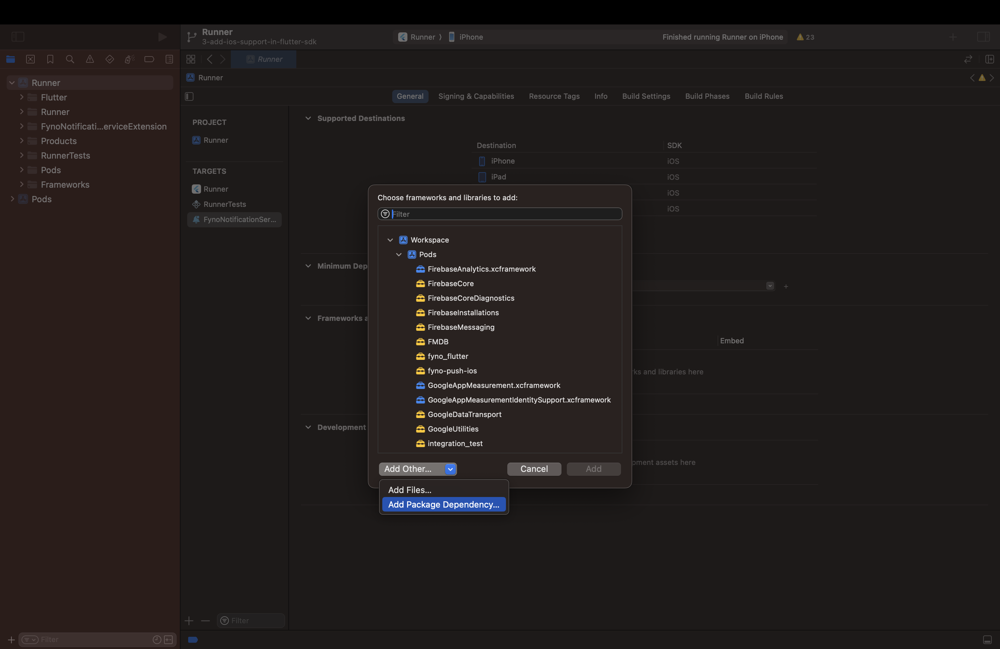
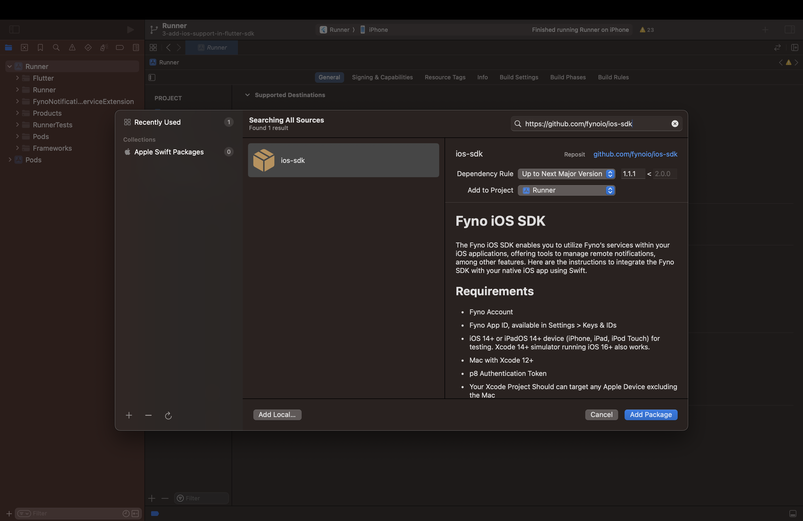
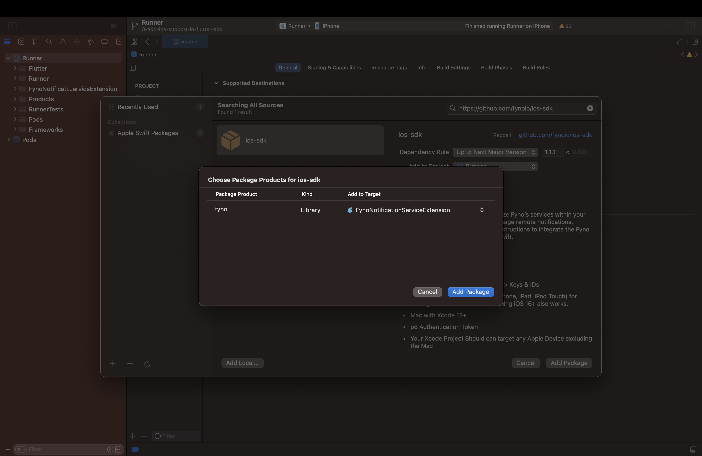

Fyno's Flutter Push Notification SDK offers a comprehensive set of notification features within your app. It's designed to efficiently deliver messages, ensuring optimal performance and user experience.

## Prerequisites

In order to get started, there are a few prerequisites that needs to be in place:

1. **Fyno account:** A valid Fyno workspace with at least one active API Key. For more info, refer [Workspace Docs](https://docs.fyno.io/docs/workspace-settings).
2. **Configuration:** Configure your Fyno Push provider in [Fyno App](https://app.fyno.io/integrations).
3. **Flutter application:** A working Flutter application in which you want to integrate the SDK.
4. **iOS specific prerequisites:**
   1. **Apple developer account:** Required details are mentioned in [APNs Docs](https://docs.fyno.io/docs/push-apns).
5. **Android specific prerequisites:**
   1. **Firebase Setup:** Setup Firebase and create application in Firebase Console. You can refer to the [FCM Documentation](https://docs.fyno.io/docs/push-fcm) for more details.
   2. **Xiaomi Setup:** Setup _Xiaomi Developer Account_ and create application in Xiaomi push console. You may refer to the [Mi Push Documentation](https://docs.fyno.io/docs/push-mi-push) for more details.
   3. Download the google-services.json from Firebase console and place it in the root folder as per [FCM Documentations](https://firebase.google.com/docs/android/setup).

## Installation

Install the `fyno_flutter` package by using one of the following commands.

```Text bash
dart pub add fyno_flutter
```

OR

```Text bash
flutter pub add fyno_flutter
```

This will add the following dependency to your package's pubspec.yaml file (and run an implicit `dart/flutter pub get`):

```Text yaml
dependencies:
  fyno_flutter: <latest_version>
```

Alternatively, your editor might support `dart pub get` or `flutter pub get`. Check the docs for your editor to learn more.

## Usage

In the Dart file where you intend to initialize the SDK, ensure to seamlessly integrate the `fyno_flutter` package by incorporating the following import statement:

```Text dart
import 'package:fyno_flutter/fyno_flutter.dart';
```

## Initialising the SDK (should be called on app launch)

- Workspace ID(Mandatory) - Fyno's unique workspace ID, which you will see at the top of the **Workspace Settings** page.
- API Key(Mandatory) - An API (Application Programming Interface) key is a code used to identify and authenticate an application or user. Create an API Key by following [API Keys](https://docs.fyno.io/docs/api-keys).
- Distinct ID(Optional) - Unique identifier for your user (An [uuid](https://en.wikipedia.org/wiki/Universally_unique_identifier) is automatically generated if no value is passed).
- Version(Optional) - Indicates the environment in which the user has to be created. Could be either **test** or **live**. (Default value is "live").

```Text dart
Future<Exception?> initException = await FynoFlutter.init(
  "workspace_id",
  "api_key",
  "distinct_id",
  "version",
);

if (initException == null) {
  // Initialization successful
} else {
  // Handle initialization error
  print("Initialization error: $initException");
}
```

## Identifying the User (should be called when you want to update previously created distinct ID or user name)

- Distinct ID(Mandatory) - The distinct ID you want to identify the user with.
- User Name(Optional) - The name you want to assign to the user.

```Text dart
Future<Exception?> identifyException = await FynoFlutter.identify("distinct_id", "user_name");

if (identifyException == null) {
  // User identification successful
} else {
  // Handle identification error
  print("Identification error: $identifyException");
}
```

## Registering Push Notifications with APNs or Google FCM

- Integration ID(Mandatory) - The ID of the integration created in [Fyno Integrations](https://app.fyno.io/integrations).
- isAPNs(Mandatory) - Use **true** if [APNs](https://docs.fyno.io/docs/push-apns) is configured, **false** if [Google FCM](https://docs.fyno.io/docs/push-fcm) is configured in the integration.

```Text dart
Future<Exception?> pushRegistrationException = await FynoFlutter.registerPush(
  "integration_id",
  isAPNs: isAPNs,
);

if (pushRegistrationException == null) {
  // Push registration successful
} else {
  // Handle push registration error
  print("Push registration error: $pushRegistrationException");
}
```

## Registering Push Notifications with Xiaomi Services (Only Android)

- Integration ID(Mandatory) - The ID of the integration created in [Fyno Integrations](https://app.fyno.io/integrations)
- Xiaomi Application Id and Xiaomi Application Key are mandatory fields which can be found under the application registered at [Xiaomi Admin](https://admin.xmpush.xiaomi.com/)
- Push Region(Mandatory) - Refers to the geographical region where push notifications are delivered.

```Text dart
Exception? pushRegistrationResult = FynoFlutter.registerPush(
  integrationId,
  xiaomiApplicationId: "xiaomi_application_id",
  xiaomiApplicationKey: "xiaomi_application_key",
  pushRegion: "push_region", // one of ‘INDIA’,’EUROPE’,’RUSSIA’,’GLOBAL’,
);

if (pushRegistrationResult == null) {
  // Push registration successful
} else {
  // Handle push registration error
  print("Push registration error: $pushRegistrationResult");
}
```

## Merging User Profiles

- Old Distinct ID(Mandatory).
- New Distinct ID(Mandatory).

```Text dart
Future<Exception?> mergeException = await FynoFlutter.mergeProfile(
  "old_distinct_id",
  "new_distinct_id",
);

if (mergeException == null) {
  // User profile merge successful
} else {
  // Handle user profile merge error
  print("User profile merge error: $mergeException");
}
```

## Updating Message Status

- Callback URL(Mandatory) - You can get the Callback URL from the notification additional payload if the notification was triggered from Fyno.
- Status(Mandatory) - The status of the notification (one of **RECEIVED**, **CLICKED** or **DISMISSED**).

```Text dart
Future<Exception?> updateStatusException = await FynoFlutter.updateStatus(
  "callback_url",
  "status",
);

if (updateStatusException == null) {
  // User status update successful
} else {
  // Handle user status update error
  print("User status update error: $updateStatusException");
}
```

## Resetting User Information (You can call this function when user logs out from your application)

```Text dart
Future<Exception?> resetUserException = await FynoFlutter.resetUser();

if (resetUserException == null) {
  // User information reset successful
} else {
  // Handle user information reset error
  print("User information reset error: $resetUserException");
}
```

## Sample initialisation

```text dart
// initialise

Future<Exception?> initException = await FynoFlutter.init(
  "workspace_id",
  "api_key",
  "distinct_id",
  "version",
);

if (initException == null) {
  // Initialization successful
} else {
  // Handle initialization error
  print("Initialization error: $initException");
}

// identify user
Future<Exception?> identifyException = await FynoFlutter.identify("new_distinct_id", "user_name");

if (identifyException == null) {
  // User identification successful
} else {
  // Handle identification error
  print("Identification error: $identifyException");
}

// register with APNs
Future<Exception?> apnsPushRegistrationException = await FynoFlutter.registerPush(
  "integration_id",
  true,
);

if (apnsPushRegistrationException == null) {
  // Push registration successful
} else {
  // Handle push registration error
  print("Push registration error: $apnsPushRegistrationException");
}
```

> 🚧 There are a few more configuration steps in order to enable iOS devices to receive push notifications.

## Getting your application ready

### Step 1: Add capabilities in iOS application

1. Inside Targets select signing and capabilities.
2. Click on +capabilities and add Push Notifications and Background Modes capabilities to your application.


3. In Background Modes, select Remote Notifications option. We use background notifications to receive delivery reports when your app is in quit and background state. Refer [doc](https://developer.apple.com/documentation/usernotifications/setting_up_a_remote_notification_server/pushing_background_updates_to_your_app) to know more about background notifications.



### Step 2: Register for push notification in AppDelegate.swift file

1. Add the below code in your **AppDelegate.swift** file.

```Text AppDelegate.swift
// without FCM

import UIKit
import Flutter
import fyno_push_ios

@UIApplicationMain
@objc class AppDelegate: FlutterAppDelegate {
    let fynosdk = fyno.app

    override func application(
        _ application: UIApplication,
        didFinishLaunchingWithOptions launchOptions: [UIApplication.LaunchOptionsKey: Any]?
    ) -> Bool {
        GeneratedPluginRegistrant.register(with: self)

        UNUserNotificationCenter.current().delegate = fynosdk

        self.fynosdk.registerForRemoteNotifications()
        fynosdk.requestNotificationAuthorization{ _ in}

        return super.application(application, didFinishLaunchingWithOptions: launchOptions)
    }

    override func application(_ application: UIApplication, didFailToRegisterForRemoteNotificationsWithError error: Error) {
        print("Failed to register for remote notifications: \(error.localizedDescription)")
    }

    override func application(_ application: UIApplication, didRegisterForRemoteNotificationsWithDeviceToken deviceToken: Data) {
        // Send the device token to fynoServer
        fynosdk.setdeviceToken(deviceToken: deviceToken)
    }
}
```

```Text AppDelegate.swift
// with FCM

import UIKit
import Flutter
import fyno_push_ios

// imports required for FCM integration
import FirebaseCore
import FirebaseMessaging

@UIApplicationMain
@objc class AppDelegate: FlutterAppDelegate {
    let fynosdk = fyno.app

    override func application(
        _ application: UIApplication,
        didFinishLaunchingWithOptions launchOptions: [UIApplication.LaunchOptionsKey: Any]?
    ) -> Bool {
        GeneratedPluginRegistrant.register(with: self)

        UNUserNotificationCenter.current().delegate = fynosdk

        self.fynosdk.registerForRemoteNotifications()

        FirebaseApp.configure() // add only if FCM has been integrated

        fynosdk.requestNotificationAuthorization {_ in}

        return super.application(application, didFinishLaunchingWithOptions: launchOptions)
    }

    override func application(_ application: UIApplication, didFailToRegisterForRemoteNotificationsWithError error: Error) {
        print("Failed to register for remote notifications: \(error.localizedDescription)")
    }

    override func application(_ application: UIApplication, didRegisterForRemoteNotificationsWithDeviceToken deviceToken: Data) {
        // Send the device token to fynoServer
        fynosdk.setdeviceToken(deviceToken: deviceToken)

        Messaging.messaging().apnsToken = deviceToken // add only if FCM has been integrated
    }
}

```

## Add Notification Service Extension to your application

1. In Xcode go to **File** > **New** > **Target**.
2. Select `Notification Service Extension` from the template list.
3. Then in Next popup give it any product name, select your team, select swift language and click finish.




4. After clicking on "Finish", a folder will be created with your given product name. Replace the contents of the **NotificationService.swift** file with the below code.

```
import UserNotifications
import UIKit
import fyno

class NotificationService: UNNotificationServiceExtension {
    var contentHandler: ((UNNotificationContent) -> Void)?
    var bestAttemptContent: UNMutableNotificationContent?

    override func didReceive(_ request: UNNotificationRequest, withContentHandler contentHandler: @escaping (UNNotificationContent) -> Void) {
        fyno.app.handleDidReceive(request, withContentHandler: contentHandler)
    }

    override func serviceExtensionTimeWillExpire() {
        if let contentHandler = contentHandler, let bestAttemptContent =  bestAttemptContent {
            contentHandler(bestAttemptContent)
        }
    }
}
```

5. In order for the **Notification Service Extension** to be able to access the fyno SDK, you will have to import it by following the below steps:





Search for `https://github.com/fynoio/ios-sdk` in the text box. Select and add the package named **ios-sdk**.



Select the Target as the Notification Service Extension you had created and click on `Add Package`.



> 👍 You have successfully configured the Flutter SDK for receiving push notifications.
